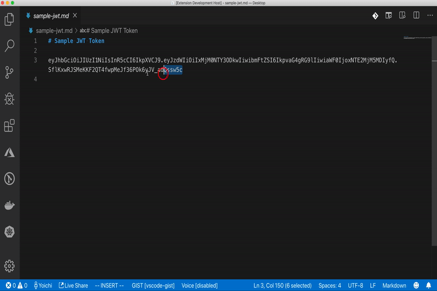

# vscode-jwt-debugger

VS Code extension for decoding JWT tokens - VS Code version of JWT debugger at [jwt.io](https://jwt.io/)

## Features
vscode-jwt-debugger allows you to decode JWT. You simply needt to select JWT encoded string and execute command `JWT Debugger Decocde` either in `Command Palette` or with keybind `Ctrl+Shift+d` (Mac: `Cmd+Shift+d`), then you'll see decoded JWT on a webview panel like this:

## Installation
- Open the `Command Palette` of VS Code with `Ctrl + P` or `Cmd + P`(MacOS)
- And type: `ext install yokawasa.jwt-debugger`

or find at [Marketplace](https://marketplace.visualstudio.com/)

## Commands
- `JWT Debugger Decocde`

> [NOTE] You can execute the command above either in `Command Palette` or with keybind `Ctrl+Shift+d` (Mac: `Cmd+Shift+d`)

## Change Log
See [Change Log](CHANGELOG.md)

## Contributing

Bug reports and pull requests are welcome on GitHub at https://github.com/yokawasa/vscode-jwt-debugger
