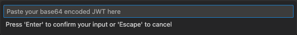

# vscode-jwt-debugger

VS Code extension for decoding JWT tokens - VS Code version of JWT debugger at [jwt.io](https://jwt.io/)

## Features

vscode-jwt-debugger allows you to decode JWT. You simply need to select JWT encoded string and execute command `JWT Debugger Decode` either in `Command Palette` or with keybind `Ctrl+Shift+d` (Mac: `Cmd+Shift+d`), then you'll see decoded JWT on a webview panel like this:

If `JWT Debugger Decode` command is executed without selecting JWT string, the following input terminal will be displayed so that users can insert their token into input terminal and decode.

## Installation
- Open the `Command Palette` of VS Code with `Ctrl + P` or `Cmd + P`(MacOS)
- And type: `ext install yokawasa.jwt-debugger`

or find at [Marketplace](https://marketplace.visualstudio.com/)

## Command & Shortcut
| Command | Shortcut | Description |
| --- | --- | --- |
| `JWT Debugger Decode` | `Ctrl+Shift+d`   (Mac: `Cmd+Shift+d`) | Decode selected JWT Token text |

> NOTE:  The command `JWT Debugger Decode` and its shortcut key are NOT available when there is no selected text. 

## Change Log
See [Change Log](CHANGELOG.md)

## Contributing

Bug reports and pull requests are welcome on GitHub at https://github.com/yokawasa/vscode-jwt-debugger
